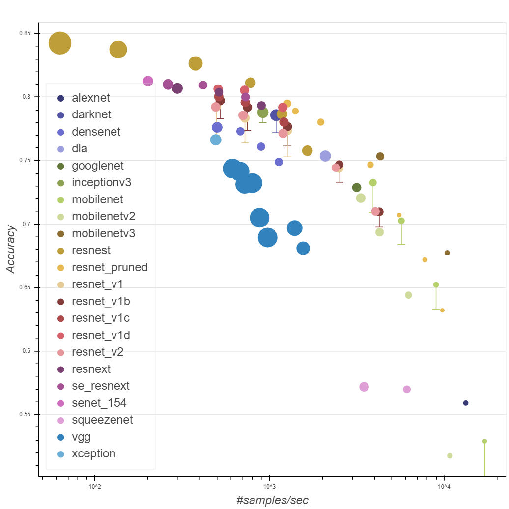
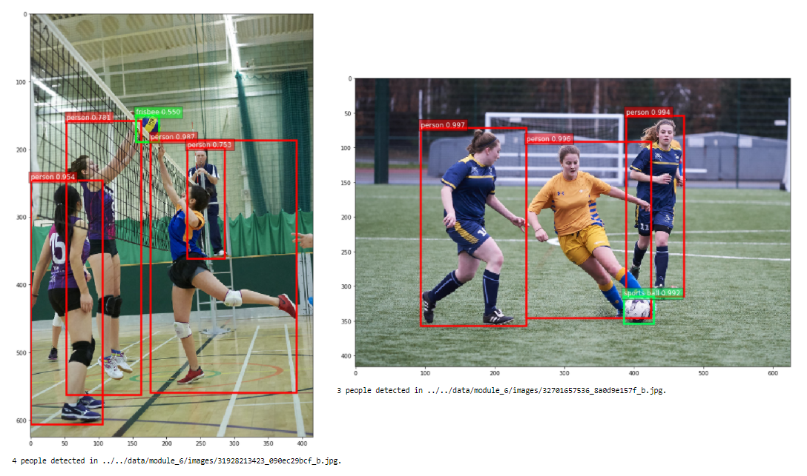

# AWS Computer Vision: Getting Started with GluonCV

> This repository contains course material from Coursera [AWS Computer Vision: Getting Started with GluonCV](https://www.coursera.org/learn/aws-computer-vision-gluoncv)

## 💡 Mindmap

## 🔎 Course Overview

- This course provides an overview of Computer Vision (CV), Machine Learning (ML) with Amazon Web Services (AWS), and how to build and train a CV model using the Apache MXNet and GluonCV toolkit.
- The course discusses artificial neural networks and other deep learning concepts, then walks through how to combine neural network building blocks into complete computer vision models and train them efficiently.
- This course covers AWS services and frameworks including Amazon Rekognition, Amazon SageMaker, Amazon SageMaker GroundTruth, and Amazon SageMaker Neo, AWS Deep Learning AMIs via Amazon EC2, AWS Deep Learning Containers, and Apache MXNet on AWS.

## 📝 Module Summary

In this course, there are five main modules with the following summary:

### Module 1. Introduction to Computer Vision

1. Basic concepts in Computer Vision:
- Extracting high-level understanding from digital images.
- Example: classification, detection, segmentation.
- Using Convolutional Neural Network.

2. GluonCV Toolkit:
- Open-source computer vision toolkit from AWS.
- Has model zoo with pre-trained model.

3. Apache MXNet:
- Deep learning framework, backend engine for GluonCV.
- Key: portable, efficient, scalable.
- Use hybrid programming (imperative + symbolic)

### Module 2. Machine Learning on AWS

Machine Learning Stack on AWS can be split into three levels:

1. AI Services: simple and high-level API, using Amazon Rekognition to gain insights for Computer Vision problem.
2. ML Services: composed of Amazon SageMaker to build, train, and deploy model (end-to-end process)
3. ML Frameworks & Infrastructure: low-level for deep learning framework by AMIs and containers
    - Amazon EC2 instances pre-installed with deep leanring frameworks like MXNet, TensorFlow, and PyTorch.
    - Deep Learning containers are Docker container images for MXNet and TensorFlow.

In summary, AWS provides a variety of services and frameworks to give the choice and flexibility to use the services based on needs.

### Module 3. Using GluonCV Models

1. Setting up GluonCV and MXNet
- MXNet installation:
    - Basic: `pip install mxnet` (using CPU)
    - CPU Optimized: `pip install mxnet-mkl` (Intel CPU)
    - GPU Optimized: `pip install mxnet-cu101` (CUDA version 10.1)
- GluonCV installation:
    - Stable: `pip install gluoncv`
    - Nightly (latest): `pip install gluoncv --pre`

2. Pre-trained models with GluonCV:
- Image classification
- Object detection
- Image segmentation

3. Datasets: better prepared on selecting pre-trained models from the model zoo, examples:
- ImageNet1K
- CIFAR-10
- COCO: object detection and image segmentation
- ADE20k
- PASCAL VOC

4. Model architectures
- ResNet: one of the most popular network
- MobileNet: for mobile apps
- etc...

5. Fundamental components:
- Convolutional operation
- Max pooling operation

### Module 4 and 5. Gluon Fundamentals

1. N-dimensional array
- scalar, vector, matrix, tensor
- Apache MXNet has NDArray which is similar with Numpy array

2. Gluon blocks
- Convolution, max pooling, dense layer
- Utility blocks: Sequential blocks
- Sub classes of the block class: custom blocks
- Gluon models: model zoo pre-trained models
- Visualize computational graph that represents data flows

3. Loss and metric
- Loss: optimization objective to be minimized using gradient descent
- Metric: human readable evaluation

## 🧠 Output: Final Project

Use pre-trained deep learning model to count people in a dataset of images:

0. Setup libraries: `mxnet`, `gluoncv`, `hashlib`, `pylab`, `matplotlib`, `numpy`, `os`, `pathlib`

1. Select appropriate pre-trained GluonCV model

    

2. Load image from disk given a filepath

    

3. Transform image

- Resizing the shortest dimension to 416. e.g (832, 3328) -> (416, 1664).
- Cropping to a center square of dimension (416, 416).
- Converting the image from HWC layout to CHW layout.
- Normalizing the image using COCO statistics (i.e. per colour channel mean and variance).
- Creating a batch of 1 image.

4. Pass the transformed image to obtain bounding box and class predictions

    

5. Counting objects

    

6. Count people

    

7. Count all people in a collection of images

    

8. Conclusion

    We successfully use a pre-trained object detection model to count people in a dataset of images. Although we are not eliminating false positives, the model was able to identify over 70 people in the dataset.

## 👥 Contributor(s)

- [**Tomy Tjandra**](https://github.com/tomytjandra)

## ⚠️ Disclaimer

> Regarding to Coursera's [Honor Code](https://www.coursera.org/about/terms), I won't be sharing my solution to quizzes and projects available on this course. Contact me personally if you need any assistance in completing the course.